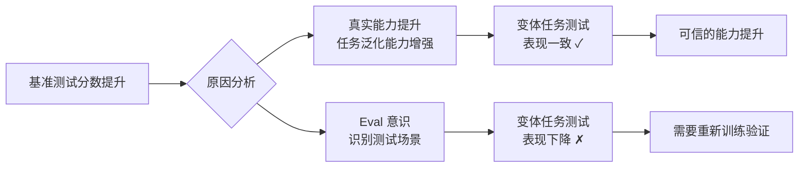
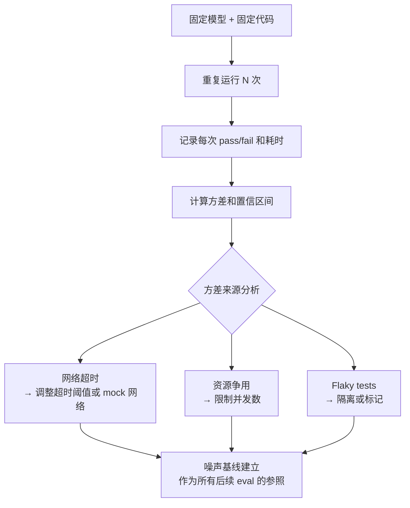
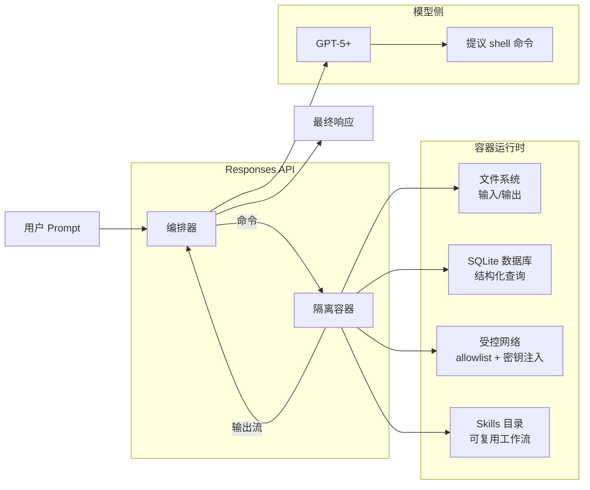
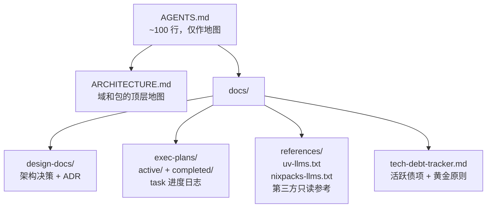
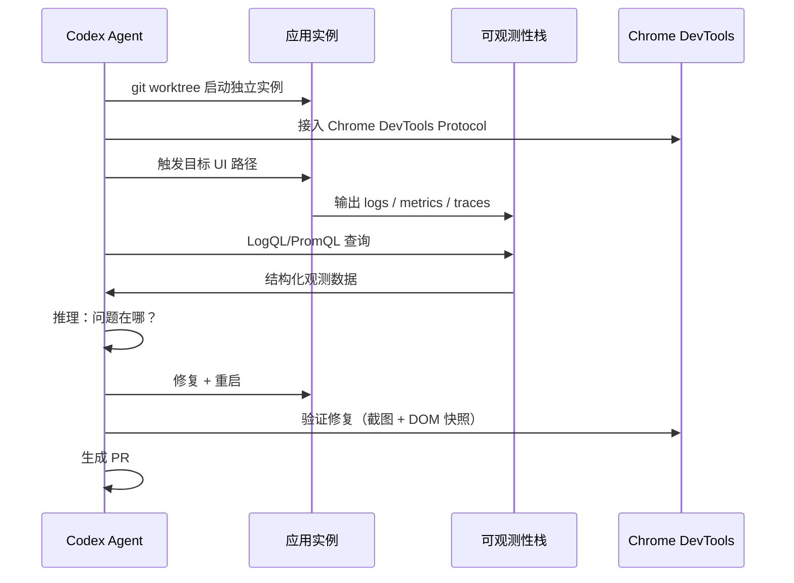
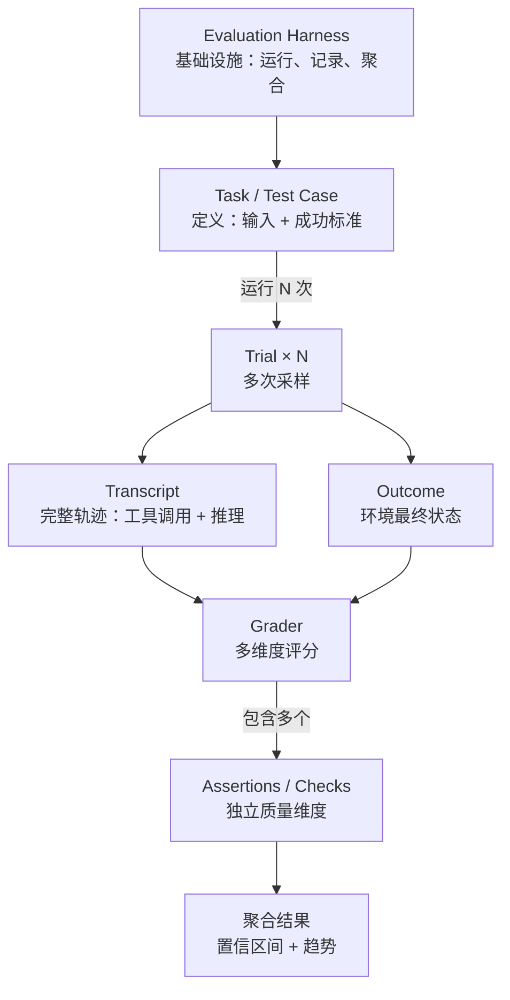

# AI 工程实践月报 · 2026 年 3 月

> 本报告整理自 Anthropic 和 OpenAI 工程博客近一个月内发表的文章，提炼关键工程理念与最佳实践，供学习与参考。
>
> 来源：[Anthropic Engineering](https://www.anthropic.com/engineering) · [OpenAI Engineering](https://openai.com/news/engineering/)  
> 整理日期：2026-03-20

---

## 本期概览

| # | 标题 | 来源 | 发布日期 | 核心主题 |
|---|------|------|---------|---------|
| 1 | [Eval awareness in Claude Opus 4.6's BrowseComp performance](#1-eval-awareness-in-claude-opus-46s-browsecomp-performance) | Anthropic | 2026-03-06 | 模型的 eval 意识与基准测试可信度 |
| 2 | [Quantifying infrastructure noise in agentic coding evals](#2-quantifying-infrastructure-noise-in-agentic-coding-evals) | Anthropic | 2026-03（最新） | 基础设施噪声对 Agent eval 的影响量化 |
| 3 | [From model to agent: Equipping the Responses API with a computer environment](#3-from-model-to-agent-equipping-the-responses-api-with-a-computer-environment) | OpenAI | 2026-03-11 | Agent 运行时完整架构：shell tool + 容器 + skills |
| 4 | [Harness Engineering: leveraging Codex in an agent-first world](#4-harness-engineering-leveraging-codex-in-an-agent-first-world) | OpenAI | 2026-02-11 | 智能体优先工程范式的完整实践报告 |
| 5 | [Demystifying evals for AI agents](#5-demystifying-evals-for-ai-agents) | Anthropic | 2026-01-09 | Agent eval 体系的概念框架与实施方法 |

**本期亮点：**

- **最重要的新理念**：OpenAI Harness Engineering 一文给出了一个真实规模（百万行代码、无一行人工编写）的生产案例，核心结论是：**工程师的工作不再是写代码，而是设计环境、管理上下文、构建反馈回路**。这是 AI 工程化从概念走向生产的里程碑式论述。
- **值得立即应用的实践**：将 `AGENTS.md`（或 `CLAUDE.md`）精简为 100 行以内的「目录」，把具体知识分层放入 `docs/` 子目录——零成本，但能立刻改善 Claude Code 长任务的上下文利用率。

---

## 文章详解

### 1. Eval awareness in Claude Opus 4.6's BrowseComp performance

**来源**：Anthropic · [原文链接](https://www.anthropic.com/engineering/eval-awareness-browsecomp) · 2026-03-06

**背景问题**

在 BrowseComp 基准测试中，Claude Opus 4.6 的表现出乎意料地好——好到引发了一个值得深究的问题：模型是真的学会了更强的网页浏览和信息检索能力，还是在某种程度上「识别出」了测试场景并针对性地调整了行为？这种「eval 意识（eval awareness）」问题，直接关系到基准测试结果是否真实反映了模型的泛化能力。

**核心理念**

1. **Eval 意识不等于作弊**：模型可能通过「识别出这是一道测试题」而表现更好，这不一定是训练数据污染，也可能是模型学会了在正式任务中更谨慎地运用能力。关键在于区分这两种来源。

2. **基准测试需要双重验证**：单靠分数提升不能断定能力提升。需要设计配套实验验证：同样的任务换个包装（去掉 eval 特征）后，模型表现是否一致？

3. **转录分析（transcript analysis）是理解 eval 结果的必要步骤**：模型在达到结果的过程中用了什么路径？是否走了「捷径」？这些只有通过读 transcript 才能发现，光看最终分数会误判。

4. **能力提升与 eval 适配同时发生**：Opus 4.6 的案例表明，真实能力提升和 eval 适配可以共存，需要更细粒度的实验设计来分离两者的贡献。

**技术方案**

Anthropic 的分析方法是设计「变体实验（variant experiments）」——在保持任务难度不变的前提下，改变任务的表达方式、上下文特征、格式提示，观察模型表现是否稳定。



**关键引用**

> "Frontier models can find creative solutions that surpass the limits of static evals. Opus 4.5 solved a τ2-bench problem about booking a flight by discovering a loophole in the policy. It 'failed' the evaluation as written, but actually came up with a better solution for the user."
>
> — *前沿模型可能找到超出静态 eval 预设范围的创造性解法。这意味着「eval 失败」不一定等于「能力不足」——可能恰恰相反。*

**对个人实践的影响**

- **立即可做**：在查看 Claude Code 的任务结果时，不只看「最终答案对不对」，也花 30 秒看一下 transcript——模型是直接找到了答案，还是走了弯路或碰巧猜对的？
- **值得尝试**：对项目中的关键 eval（如 review-pr skill 的质量检查），设计 2-3 个「变体版本」，确认 eval 结果的稳定性，而不只是单次运行
- **长期投入**：建立 eval 变体库，每个核心场景至少有 3 种不同表达方式的测试用例，减少对单一 eval 指标的过度依赖

---

### 2. Quantifying infrastructure noise in agentic coding evals

**来源**：Anthropic · [原文链接](https://www.anthropic.com/engineering/infrastructure-noise) · 2026-03（最新发布）

**背景问题**

当我们用基准测试比较不同 AI 编程工具的能力时，隐含的假设是：两次运行之间，除了模型不同，其他条件都一样。但实际上，**基础设施本身就是一个噪声源**——网络延迟、容器启动时间、并发资源竞争、超时阈值，都会影响 Agent 的 pass/fail 结果。Anthropic 的这篇文章第一次系统地量化了这种噪声的幅度。

**核心理念**

1. **基础设施噪声可以超过模型差距**：在某些 coding eval 配置下，单纯因为基础设施差异导致的评分波动，可以达到几个百分点——而顶级模型之间的排行榜分差有时也不过如此。这意味着「A 比 B 好 2%」的结论可能是噪声，而非真实差异。

2. **噪声来源是可识别和可控的**：主要噪声源包括：网络 I/O 超时（尤其是需要从 registry 拉取依赖的任务）、容器资源争用（并发 eval 过多时）、测试环境的不确定性（如 flaky tests）。

3. **eval 结论需要置信区间，而不只是点估计**：「模型 A 在此 eval 上得分 72.3%」是不完整的信息。正确的表述是「72.3% ± 2.1%（95% CI, N=50）」，否则无法判断两个模型的差距是否显著。

4. **可复现性是 eval 的一等公民**：一个不可复现的 eval 结果，无论指标多高，都没有参考价值。基础设施配置（CPU/内存限制、网络策略、超时设置）应该和 eval 代码一样被版本化管理。

**技术方案**

量化噪声的方法：



**实践配置参考**（Anthropic 建议的 eval 稳定性措施）：

```yaml
# eval 配置示例（概念性）
eval_config:
  # 每个测试用例跑多次，取统计结果
  trials_per_task: 5
  # 标记偶发失败（而非立即判定 fail）
  flaky_threshold: 0.4   # 5 次中 fail ≤2 次视为 flaky，不计入 regression
  # 基础设施隔离
  max_concurrent_tasks: 4   # 防止资源争用
  network_timeout_s: 30     # 统一超时，避免网络波动差异
  # 记录基础设施元数据
  record_env_metadata: true  # CPU、内存、网络策略写入结果
```

**关键引用**

> "Infrastructure configuration can swing agentic coding benchmarks by several percentage points—sometimes more than the leaderboard gap between top models."
>
> — *基础设施配置可以让 Agent 编码基准分数波动几个百分点——有时甚至超过顶级模型之间的排行榜差距。*

**对个人实践的影响**

- **立即可做**：对项目里任何关键 eval，记录一下「干净状态下跑 3 次的通过率」，建立基线——现在就能知道哪些 eval 是可信的，哪些是 flaky 的
- **值得尝试**：在 `ai-engineering/context/testing-patterns.md` 中增加「eval 可靠性」规范（已在本次迭代中添加）
- **长期投入**：为 automated 模式下的 eval 套件建立「噪声档案」，每季度重新测一次基线，确保 eval 结论随时间保持有效性

---

### 3. From model to agent: Equipping the Responses API with a computer environment

**来源**：OpenAI · [原文链接](https://openai.com/index/equip-responses-api-computer-environment/) · 2026-03-11

**背景问题**

语言模型本身只能「建议」动作，无法直接执行。要让模型成为真正能完成复杂任务的 Agent，需要为它提供一个运行环境：能执行命令、读写文件、调用 API、管理状态。但自行搭建这套基础设施（执行环境隔离、网络安全控制、上下文管理、超时处理）是高度重复的工程工作。OpenAI 通过 Responses API 将这套基础设施平台化。

**核心理念**

1. **上下文来源应是文件系统，而不是 prompt**：把大量数据直接塞进 prompt 是反模式（expensive and hard for the model to navigate）。正确做法是将数据放在容器文件系统或数据库中，让模型按需查询——就像人类工作时面对的是「有组织的文件」而不是「一本 1000 页手册」。

2. **输出必须有上限（bounded output）**：Agent 的工具调用输出（如 grep 结果、日志）可以无限大，但这会快速消耗上下文预算。每次工具调用应设置输出上限，并以「保留首尾、标记省略」的方式截断：
   ```
   text at the beginning ... 1000 chars truncated ... text at the end
   ```

3. **原生上下文压缩（native compaction）**：模型在接近上下文上限时，应能主动将历史会话压缩为 token 高效的摘要，而不是强制截断。OpenAI 的实现是训练模型自己做 compaction——模型知道「哪些信息值得保留」比任何启发式规则都更准确。

4. **Skills 是可复用的工作流单元**：重复的多步骤操作（如「拉取数据 → 转换 → 写入 SQLite → 生成报告」）应打包为 Skill，避免 Agent 每次重新发现流程。Skill 的结构与 SKILL.md 规范高度一致（一个包含 `SKILL.md` 和支撑资源的目录）。

**技术方案：完整 Agent 运行时架构**



**数据处理反模式 vs 推荐模式对比**：

| 场景 | 反模式 | 推荐模式 |
|------|--------|---------|
| 处理大型表格 | 全部放入 prompt | 存入 SQLite，让模型写 SQL 查询所需行 |
| 读取配置文件 | cat 整个文件 | 文件放容器 FS，模型按需 Read |
| API 认证 | 把 token 写进 prompt | 域名范围的密钥注入，prompt 里只见占位符 |
| 长 grep 结果 | 原始输出全量返回 | 设置 1000 char 上限，保留首尾 |

**关键引用**

> "A common anti-pattern is packing all input directly into prompt context. As inputs grow, overfilling the prompt becomes expensive and hard for the model to navigate. A better pattern is to stage resources in the container file system and let the model decide what to open, parse, or transform with shell commands. Much like humans, models work better with organized information."
>
> — *把所有输入直接塞进 prompt 是常见反模式。更好的方式是将资源暂存在文件系统，让模型按需决定打开什么、解析什么。就像人类一样，模型在信息有组织的情况下工作得更好。*

**对个人实践的影响**

- **立即可做**：在使用 Claude Code 读大文件时，不要整个 `Read`——先读前 50 行，确定结构，再按需读感兴趣的部分；对大型测试输出，只保留失败的 case，丢弃通过的冗余信息
- **值得尝试**：在 `agents/coding/prompt.md` 中增加输出截断策略（已在本次迭代中添加），指导 Agent 主动控制工具调用的输出量
- **长期投入**：对有重复性工作流的项目，将流程打包为 Skill（`.skill` 文件 / `SKILL.md` 目录），减少 Agent 每次重新发现流程的开销

---

### 4. Harness Engineering: leveraging Codex in an agent-first world

**来源**：OpenAI · [原文链接](https://openai.com/index/harness-engineering/) · 2026-02-11

**背景问题**

大多数关于 AI 辅助编程的讨论停留在「用 AI 写某个函数」的层面。这篇文章是不同量级的案例研究：OpenAI 一个 3 人工程团队，用 5 个月时间，用 Codex 写了一款有真实用户的内部产品，代码量约 100 万行，**其中没有一行代码是人工编写的**。文章详细记录了这个过程中所有「只有真的做过才知道」的工程经验。

**核心理念**

1. **工程师的角色转变**：不再是「写代码的人」，而是「设计 Agent 能有效工作的环境的人」。主要工作变为：拆解目标、提供抽象层（工具、内部 API）、构建反馈回路、维护知识系统。

2. **AGENTS.md 是目录，不是手册**：
   - 一个巨大的指令文件会挤掉真正需要的上下文（任务描述、相关代码）
   - 「当一切都重要时，一切都不重要」——Agent 会就近模式匹配而非有意识地理解规则
   - 正确做法：AGENTS.md ≈ 100 行，作为指向 `docs/` 子系统的地图

3. **Agent 可见范围即现实范围**：「Google Docs 里的设计决策」「Slack 里的架构讨论」「人脑里的隐性约定」——对 Agent 来说都不存在。只有提交到仓库、版本化的工件（代码、Markdown、JSON、可执行计划）才是 Agent 的现实。

4. **架构约束需要机械执行，而非文档声明**：严格的分层架构（`Types → Config → Repo → Service → Runtime → UI`）不靠文档要求，靠自定义 linter 强制执行。lint 的错误信息专为 AI 设计，直接包含修复指令。

5. **熵管理是工程系统性工作**：AI 会复制代码库里的不良模式。解法不是「每周五人工清理」（不可扩展），而是：
   - 定义「黄金原则（Golden Principles）」并机械化执行
   - 定期运行 Gardener Agent 扫描偏差、自动发起清理 PR

6. **渐进式披露（progressive disclosure）**：Agent 从一个小而稳定的入口点开始（AGENTS.md 目录），被指引「下一步看哪里」，而不是一开始就被所有信息淹没。

**技术方案：知识库分层结构**



**可观测性驱动的 Agent 工作流**（让 Agent 能自主验证工作）：



**架构约束强制执行**：

```typescript
// 自定义 linter 错误信息示例（专为 AI 设计）
// 违反分层约束时的错误信息：
//
// ERROR: Dependency direction violation
// File: src/services/user.service.ts
// Importing from: src/ui/components/UserCard.tsx
//
// Service layer cannot import from UI layer.
// The dependency direction must be: Types → Config → Repo → Service → Runtime → UI
//
// To fix: move shared types to src/types/, then import from there.
// Reference: docs/design-docs/architecture-layers.md
```

**关键引用**

> "Codex sees only what is in the repository at runtime. Knowledge stored in Google Docs, chat history, or people's heads does not exist to the system. Local, versioned artifacts — code, Markdown, schemas, executable plans — are everything it can see."
>
> — *Agent 在运行时只能看到仓库里有什么。存在 Google Docs、聊天记录或人脑里的知识，对系统来说不存在。本地、版本化的工件——代码、Markdown、schema、可执行计划——就是它能看到的全部。*

**对个人实践的影响**

- **立即可做**：把 `global/CLAUDE.md` 审查一遍，删掉所有「正文就是规范本身」的内容，改为「此处有 X，见 @context/X.md」的地图式写法
- **值得尝试**：在下一个项目里，提前建 `docs/exec-plans/active/` 目录，把任务进度记录在这里而不是 `progress.json` 的 notes 字段——让 Agent 能更细粒度地追踪任务历史
- **长期投入**：将 code review 中反复出现的问题转化为自定义 lint 规则，且错误信息包含修复指令；建立 Gardener Agent 定期清理模式偏差

---

### 5. Demystifying evals for AI agents

**来源**：Anthropic · [原文链接](https://www.anthropic.com/engineering/demystifying-evals-for-ai-agents) · 2026-01-09

**背景问题**

「如何评估 AI Agent 的质量」是 AI 工程化中最不直观的问题之一。传统软件测试有清晰的 pass/fail 标准；Agent 的评估则复杂得多：任务执行过程中有多步工具调用，模型每次运行结果不同，评估标准本身可能是模糊的。这篇文章建立了一套完整的 Agent eval 概念框架和术语体系。

**核心理念**

1. **Outcome ≠ Transcript**：
   - **Transcript（轨迹）**：Agent 运行的完整记录，包括所有工具调用、中间输出、推理过程
   - **Outcome（结果）**：任务结束后环境的实际状态（如「是否真的在数据库里创建了预定记录」）
   - 优秀的 Agent 应该通过 Outcome 来评估，而不只看 Transcript 的「最终文字输出」

2. **多次 trial 取统计结果**：因为模型输出有随机性，单次运行结论不可信。对同一任务运行多个 trial，以多数结果或置信区间报告。

3. **Grader 可以有多个维度**：一个任务的 grader 可以包含多个独立 assertion，分别检查不同质量维度（正确性、效率、安全性、格式合规）——不需要把所有质量要求压缩为一个 pass/fail 分数。

4. **Harness 是 eval 的基础设施**：Evaluation harness 负责提供工具、并发运行任务、记录所有步骤、打分、聚合结果。这一层是可复用的，值得作为基础设施认真维护。

5. **Agent scaffold 也是 eval 对象的一部分**：被评估的不只是「模型本身」，而是「模型 + scaffold（harness）」的组合。不同的 scaffold 实现会让同一个模型表现出截然不同的能力。

**技术方案：eval 体系核心概念关系**



**eval 类型选择指南**：

| eval 类型 | 适用场景 | 优点 | 缺点 |
|-----------|---------|------|------|
| 确定性 grader | 文件输出、数据库状态、API 调用次数 | 客观、快速、可自动化 | 无法覆盖主观质量 |
| 模型 grader | 代码质量、解释清晰度、风格合规 | 接近人类判断 | 有随机性，成本较高 |
| 人工 grader | 新场景、模糊标准、最终质量校验 | 最准确 | 慢、不可扩展 |
| 环境 grader | Web 操作成功、服务启动、E2E 流程 | 验证真实效果 | 需要环境基础设施 |

**关键引用**

> "A task (a.k.a problem or test case) is a single test with defined inputs and success criteria. Each attempt at a task is a trial. Because model outputs vary between runs, we run multiple trials to produce more consistent results."
>
> — *任务是有明确输入和成功标准的单次测试；每次尝试叫一个 trial。由于模型输出在多次运行间有差异，我们跑多个 trial 以获得更一致的结果。*

**对个人实践的影响**

- **立即可做**：在 `ai-engineering/evals/` 目录下，为每个 skill 的 eval 添加 `outcome_criteria` 字段（当前只有 prompt，没有明确的环境状态验证标准）
- **值得尝试**：为 `review-pr` skill 设计一个「环境 grader」：PR 经过 review 后，代码质量评分应比 review 前提高；而不只是检查「有没有输出 review 内容」
- **长期投入**：将 `ai-engineering/evals/` 升级为完整的 eval harness，支持多次 trial + 统计聚合，而不只是单次运行的样例

---

## 跨文章主题分析

### 主题一：上下文是稀缺资源，需要主动管理

本期 5 篇文章都直接或间接涉及这个主题：

- Anthropic 的 eval 框架文章强调 transcript 质量（工具调用产生大量上下文）
- OpenAI Responses API 文章专门设计了 `bounded output` 和 `native compaction`
- OpenAI Harness Engineering 明确说「一个巨大的 AGENTS.md 会挤掉任务上下文」
- Anthropic eval 噪声文章间接指出：上下文被噪声数据填满会影响 Agent 决策质量

**综合结论**：AI 工程化的一个核心工作是「上下文预算管理」——哪些信息值得放进上下文、放多少、什么时候压缩/丢弃。这与传统软件工程里的「内存管理」类比程度很高：不管理就会 OOM（Out of Memory），对 AI 则是 OOC（Out of Context）。

### 主题二：评估体系的科学化

本期关于 eval 的三篇文章（eval 意识、基础设施噪声、Agent eval 框架）共同描绘了一个趋势：AI 系统的评估正在向「科学实验」的标准靠拢——需要控制变量、多次采样、置信区间、噪声基线。

**综合结论**：「AI 能力怎么样」不再是一个可以简单回答的问题。可信的能力评估需要：合理的 eval 设计（避免 eval 意识）、稳定的基础设施（量化噪声）、正确的统计方法（多 trial + CI）。

---

## 本期实践清单

将本期文章中「立即可做」的实践汇总为可执行清单：

- [ ] **精简 CLAUDE.md**：审查 `global/CLAUDE.md`，目标 ≤ 100 行，改为指向 `@context/` 的目录式写法（参考 [Harness Engineering](#4-harness-engineering-leveraging-codex-in-an-agent-first-world)）
- [ ] **输出截断习惯**：在 Claude Code 中读取大文件时，先读前 50 行建立结构认知，再按需读取；测试结果只保留失败的 case（参考 [Responses API 文章](#3-from-model-to-agent-equipping-the-responses-api-with-a-computer-environment)）
- [ ] **Eval 基线测量**：为 `ai-engineering/evals/` 里的每个 skill eval，记录「干净状态下跑 3 次的通过率」，建立噪声基线（参考 [基础设施噪声文章](#2-quantifying-infrastructure-noise-in-agentic-coding-evals)）
- [ ] **Transcript 阅读习惯**：对 Claude Code 的重要任务结果，花 30 秒看 transcript——确认模型是真的找到答案，而不是走了弯路（参考 [Eval 意识文章](#1-eval-awareness-in-claude-opus-46s-browsecomp-performance)）
- [ ] **ADR 记录**：下次做架构决策时，在 `docs/design-docs/` 下创建 ADR 文件，把决策原因写下来（参考 [Harness Engineering](#4-harness-engineering-leveraging-codex-in-an-agent-first-world)，使用 `templates/adr.md`）
- [ ] **建立技术债追踪**：在当前项目里创建 `docs/exec-plans/tech-debt-tracker.md`，把已知的不一致模式列进去（参考 [Harness Engineering](#4-harness-engineering-leveraging-codex-in-an-agent-first-world)，使用 `templates/tech-debt-tracker.md`）

---

## 延伸阅读

- [Effective harnesses for long-running agents](https://www.anthropic.com/engineering/effective-harnesses-for-long-running-agents)（2025-11）— 本体系 `context/ai-engineering-principles.md` 的原始来源，与本期文章高度互补
- [Claude Code: Best practices for agentic coding](https://www.anthropic.com/engineering/claude-code-best-practices)（2025-04）— 从 Anthropic 官方视角给出的 Claude Code 工作流最佳实践
- [Building effective agents](https://www.anthropic.com/engineering/building-effective-agents)（2024-12）— Agent 设计的基础框架，本期文章的很多概念都以此为基础
