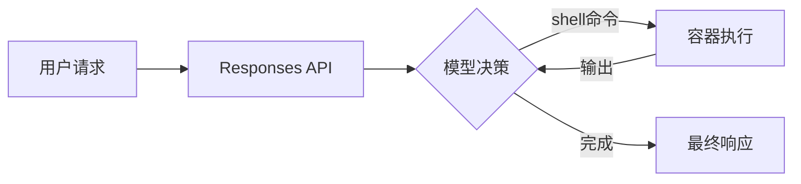

# 报告模板与格式规范

本文件定义 AI Engineering Digest 报告的完整结构、格式要求和写作标准。

---

## 完整报告结构

````markdown
# AI 工程实践月报 · YYYY 年 M 月

> 本报告整理自 Anthropic 和 OpenAI 工程博客近一个月内发表的文章，提炼关键工程理念与最佳实践，供学习与参考。
>
> 来源：[Anthropic Engineering](https://www.anthropic.com/engineering) · [OpenAI Engineering](https://openai.com/news/engineering/)  
> 整理日期：YYYY-MM-DD

---

## 本期概览

| # | 标题 | 来源 | 发布日期 | 核心主题 |
|---|------|------|---------|---------|
| 1 | [文章标题](#anchor) | Anthropic | YYYY-MM-DD | 一句话主题 |
| 2 | [文章标题](#anchor) | OpenAI | YYYY-MM-DD | 一句话主题 |

**本期亮点：**

- **最重要的新理念**：用 1-2 句话总结本期最值得关注的工程理念
- **值得立即应用的实践**：哪一条最容易融入个人工作流

---

## 文章详解

### 1. 文章标题

**来源**：Anthropic · [原文链接](https://...) · YYYY-MM-DD

**背景问题**

> 用 2-3 句话说清楚：这篇文章在解决什么问题？为什么这个问题值得写一篇文章？

**核心理念**

列出 3-5 条本文的关键理念，每条附简短说明：

1. **理念名称**：具体阐释，说明 why，不只说 what
2. **理念名称**：...

**技术方案**

详细描述具体的技术方案、系统设计或工作流程。如有架构图，用 mermaid 绘制。



如有代码示例，保留原文代码，注释可翻译：

```python
# 示例：配置上下文压缩阈值
response = client.responses.create(
    model="gpt-5",
    input=messages,
    # 当上下文达到 80% 时自动触发压缩
    compaction={"threshold": 0.8}
)
```

**关键引用**

> 从原文中摘录 1-2 句最有价值的原话（英文原文），附中文翻译。

**对个人实践的影响**

从具体应用角度分析：使用 Claude Code 时，这些理念如何改变我的工作方式？提供可操作的建议：

- **立即可做**：...（不需要任何额外工具/配置的实践）
- **值得尝试**：...（需要少量设置的实践）
- **长期投入**：...（需要较多工作但收益大的实践）

---

### 2. 文章标题

（同上结构，重复）

---

## 跨文章主题分析

分析本期多篇文章中反复出现的共同主题或相互印证的理念。

### 主题一：[主题名称]

哪些文章都在强调这个方向？它们的侧重点有何不同？综合来看，这个趋势意味着什么？

### 主题二：[主题名称]

（同上）

---

## 本期实践清单

将本期文章中「立即可做」的实践汇总为一个可执行清单，方便直接行动：

- [ ] **实践 1**：具体描述，参考来源（[文章名](#anchor)）
- [ ] **实践 2**：具体描述
- [ ] **实践 3**：具体描述

---

## 延伸阅读

如本期提到了引用或关联的往期文章，在此列出：

- [文章标题](链接) — 相关性说明
````

---

## 写作质量标准

### 深度要求

- **背景问题**：不能只说「介绍了 X」，要说清楚为什么 X 是个问题、行业当前的痛点是什么
- **核心理念**：每条理念必须有「why」——为什么这样做比其他方式好？有什么取舍？
- **技术方案**：必须达到「读完就知道怎么做」的程度，不能只是摘要式的一句话

### 可读性要求

- 专有名词首次出现时附中文说明（如 `context compaction（上下文压缩）`）
- 代码块必须有语言标注（\`\`\`python、\`\`\`typescript 等）
- mermaid 图表测试：确保节点名无特殊字符，引号使用英文双引号
- 段落不超过 6 行，复杂内容用列表拆分

### 实践建议要求

- 实践建议必须具体：不写「优化上下文」，写「在每个 feature commit 之后，用 2-5 句话写阶段摘要替代之前的工具调用记录」
- 分「立即可做 / 值得尝试 / 长期投入」三级，方便按精力选择
- 如与 ai-engineering 仓库的现有内容相关，明确指出可补充到哪个文件

### 发表标准

- 报告应能直接发布到个人博客或团队内部知识库
- 首段「本期概览」表格确保信息准确（文章实际发布日期）
- 无拼写错误，术语使用一致（全文统一「上下文」不混用「context」）
